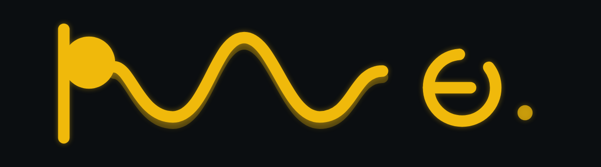

# Brand

Two layers, never mixed: **pulse** (the product) and **BNB Chain** (affiliation). Official BNB source: [brand guidelines](https://www.bnbchain.org/en/brand-guidelines). Requirements: [`openspec/specs/brand/spec.md`](../openspec/specs/brand/spec.md).

## Quick path

1. Product mark is **pulse persist** — CRT phosphor with a short afterglow. Files in [`apps/web/public/product/`](../apps/web/public/product/).
2. Affiliation: yellow `#F0B90B`, black `#0B0E11`, white `#FFFFFF`. Say **Building on BNB Chain**. Never Official, Partnering, or Collaborating unless BNB Chain cleared it.
3. BNB lockups: unmodified yellow SVGs from `apps/web/public/brand/` on `#0B0E11`, left-aligned, min 97px wide.
4. Header is the pulse persist mark. Footer is “Building on” + BNB lockup. Do not put the BNB lockup in the header.

## Details

### pulse persist

The name is lowercase **pulse**. The locked cut is **persist**: one phosphor family (`#F0B90B`) on `#0B0E11`. The `p` is the beam (stem + focused spot). `uls` is a time-domain sweep. The `e` is XY / Lissajous, left open. A second, dimmer sweep sits under the live trace — analog persistence, not a drop shadow.

Rebuild PNG and ICO from the React mark with Remotion:

```bash
pnpm --filter @era/web brand:export
```



| Asset | Path |
|-------|------|
| SVG lockup | `apps/web/public/product/pulse.svg` |
| SVG mark | `apps/web/public/product/pulse-mark.svg` |
| PNG lockup | `apps/web/public/product/pulse-lockup.png` |
| PNG icon | `apps/web/public/product/pulse-icon.png` |
| ICO | `apps/web/public/product/favicon.ico` |

Preview cuts: [http://localhost:5173/lockups](http://localhost:5173/lockups) (persist is locked; others are archive).

### BNB Chain affiliation

| Token | Value | Use |
|-------|--------|-----|
| Yellow / Pantone 116C | `#F0B90B` | Accent, primary buttons, official logos, pulse phosphor |
| Black | `#0B0E11` | App background, CRT field |
| White | `#FFFFFF` | Primary text on black |
| Type | Space Grotesk | App UI; the pulse mark is drawn, not typeset |

| Asset | File | Min size |
|-------|------|----------|
| Horizontal lockup (yellow) | `apps/web/public/brand/bnb-chain-logo-yellow.svg` | 97px wide |
| Logomark (yellow) | `apps/web/public/brand/bnb-chain-symbol-yellow.svg` | 15px wide |
| Horizontal lockup (white) | `apps/web/public/brand/bnb-chain-logo-white.svg` | 97px, only if yellow fails contrast |

### Where the app uses it

| Surface | Treatment |
|---------|-----------|
| Header | pulse persist lockup |
| Favicon | pulse persist mark (ICO + SVG) |
| Home kicker | “Building on” + BNB yellow horizontal lockup (140px) |
| Footer | “Building on” + BNB lockup + [guidelines](https://www.bnbchain.org/en/brand-guidelines) link |
| RainbowKit | Accent `#F0B90B`, foreground `#0B0E11` |

### Do

- Keep BNB safe space around the BNB lockup (about one logomark-height).
- Prefer yellow logos on `#0B0E11`.
- Keep official BNB files unaltered.
- Use the BNB logo only to identify that this project is building on BNB Chain.

### Do not

- Imply BNB Chain endorses this hackathon entry.
- Put the BNB lockup in the header or use it as the product mark.
- Recolour, outline, or stretch official BNB SVGs.
- Use “Official”, “Partnering”, or “Collaborating”.

## Checklist

- [x] Primary button is `#F0B90B` on `#0B0E11`
- [x] Footer says Building on, not Official
- [x] BNB logo SVG is an official file
- [x] Footer links to https://www.bnbchain.org/en/brand-guidelines
- [x] Header and favicon use pulse persist, not the BNB logomark

## Next step

When changing the pulse mark, edit `pulse-persist-mark.tsx`, run `pnpm --filter @era/web brand:export`, and re-check [`openspec/specs/brand/spec.md`](../openspec/specs/brand/spec.md).
