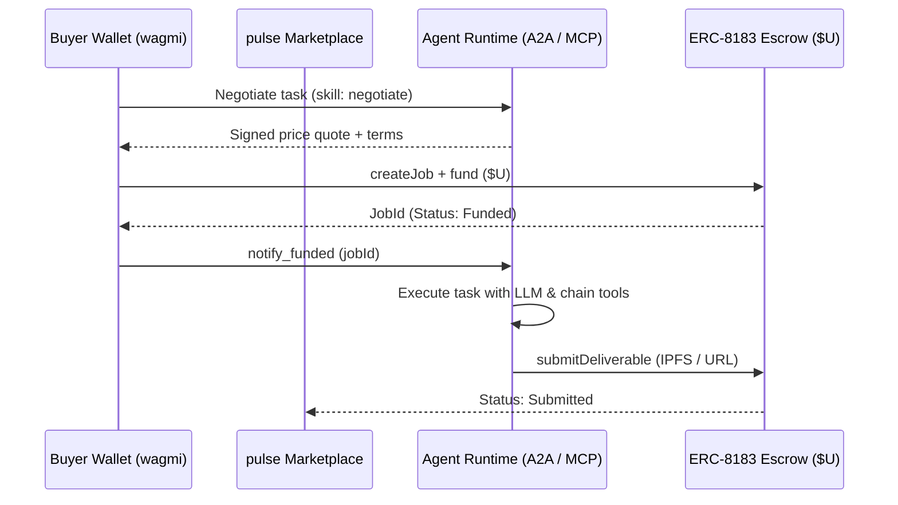

# Design: Seed Studio Agents for pulse

## Context

Workstream **A** owns `agents/*` in accordance with [`AGENTS.md`](file:///d:/Proyectos/Blockchain/pulse/AGENTS.md) and [`CONTRIBUTING.md`](file:///d:/Proyectos/Blockchain/pulse/CONTRIBUTING.md).
See [`proposal.md`](file:///d:/Proyectos/Blockchain/pulse/openspec/changes/scaffold-seed-agents/proposal.md) for background and motivation.

## Goals / Non-Goals

**Goals:**
- Provide four standard BNB Agent Studio projects in `agents/` matching the four marketplace categories (`health_factor`, `rebalancing`, `yield`, `grid_trading`).
- Configure `agentcore` runtime exposing A2A agent cards (`/.well-known/agent-card.json`), MCP streamable HTTP (`/mcp`), and B402 HTTP micropayments (`/x402`).
- Support ERC-8183 escrow quoting and fulfillment in `$U` (BSC Testnet currency address `0xc70B8741B8B07A6d61E54fd4B20f22Fa648E5565`).
- Ensure local key generation via `bag wallet new` and ERC-8004 identity registration on BSC Testnet (chain id 97).

**Non-Goals:**
- Modifying `apps/web` or `packages/domain` (strictly forbidden for Workstream A).
- Custom proprietary agent execution runtimes or non-standard protocols.

## Decisions

### 1. Official CLI (`@bnbagent/studio-cli` / `bag`)
- **Rationale**: Guarantees alignment with official BNB Chain Agent Studio specifications, provides turnkey A2A and MCP protocol wrappers, and includes ERC-8183 negotiation/fulfillment hooks out of the box.
- **Alternatives**: Custom Node/Express server (rejected: violates stack spec and increases maintenance overhead).

### 2. Wallet Backend: `evm-local`
- **Rationale**: Local encrypted keystore stored in `.studio/wallets/` outside the deploy bundle. Supports SIWE signature verification required by Pieverse LLM free tier activation.
- **Alternatives**: `altana` session keys (reserved for production deployment phase; requires EOA onboarding first).

### 3. Hire & Deliverable Flow

## Risks / Trade-offs

- **[Risk: Secret Leakage]**: Private keys and local environment variables committed to git.
  - **Mitigation**: Each agent workspace includes `.gitignore` ignoring `.studio/` and `agentcore/.env.local`.
- **[Risk: Monorepo Root Conflict]**: Individual agent package.json files conflicting with root pnpm workspace.
  - **Mitigation**: Agents maintain their own dedicated `pnpm-workspace.yaml` and isolated dependencies under `agents/*`. Root `pnpm-workspace.yaml` only watches `apps/*` and `packages/*`.
